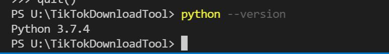
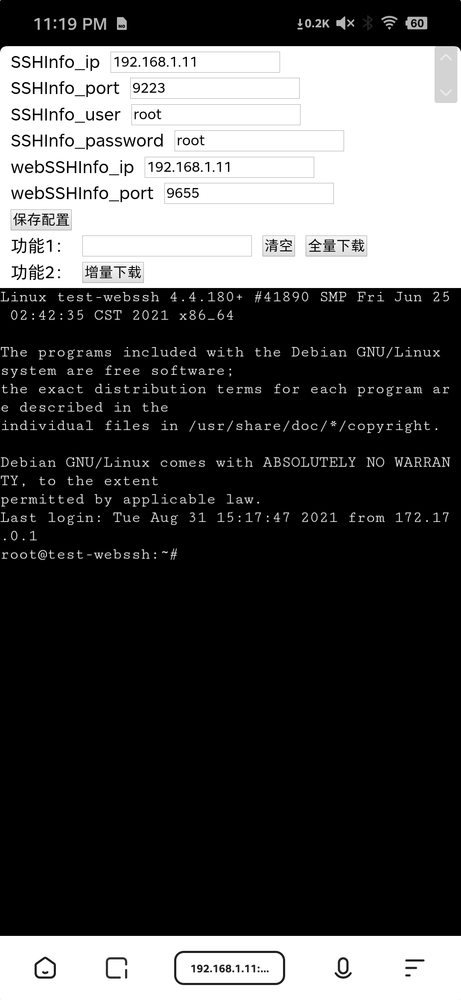
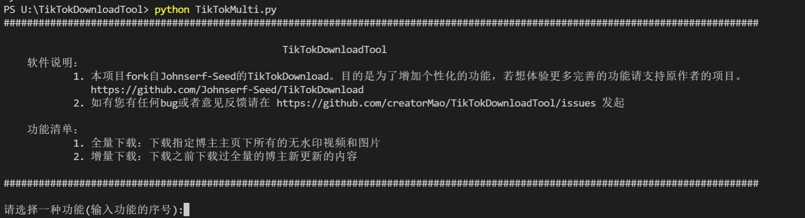
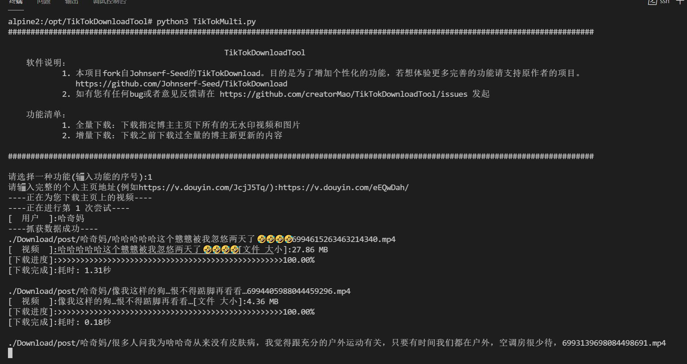
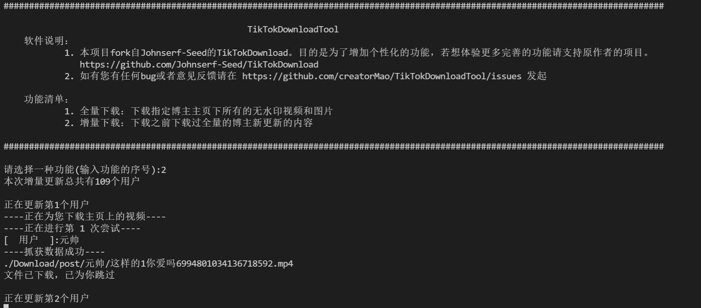
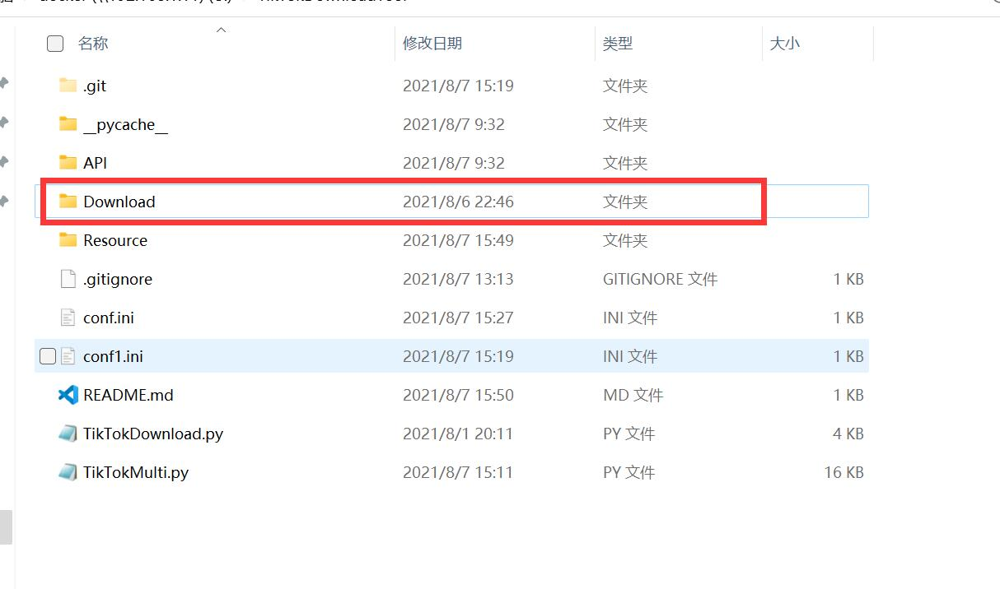

  

#

# 版权说明&Fork原因
本项目下载逻辑fork自[Johnserf-Seed TikTokDownload](https://github.com/Johnserf-Seed/TikTokDownload)。

fork原项目的目的是为了增加个性化的功能(若你和我一样，喜欢一个人就爱屋及乌,他所有的视频,包括每天新更新的，你都想下载的话，本项目比较适合你~)

本项目暂不支持单个视频下载，若想体验更多完善的功能请支持原作者的项目。

# 免责声明
本代码仅用于学习，下载后请勿用于商业用途。

# Todo
- [] 优化视频是否下载过判断逻辑，改成从数据库判断，而不是判断文件是否物理存在
- [] 修复当用户更改名字后，增量下载又会重新下载一遍的问题~

# 环境要求
- 请检查宿主机，是否安装了python环境，并且配置了环境变量
~~~
    python --version 
~~~

- 请下载以下python库
~~~
    pip install requests
    pip install retrying
~~~

# 功能
- [x] 全量下载：下载指定博主主页下所有的无水印视频和图片
- [x] 增量下载：下载之前下载过全量的博主新更新的内容

1. 建议先使用全量下载功能，先下载一遍全部视频。
2. 再使用增量下载功能，定期下载即可。（全量下载以后，会将当前博主放到增量下载列表里，选择增量下载功能时，无需再复制链接）

# 使用方法

## 1. Docker 

~~~
docker pull creatormao/tiktokdownloadtool:latest

docker run -d -v /volume1/docker/TEST-DOWN:/opt/TikTokDownloadTool/Download --name titokdownload -p 9222:22 -p 9876:8000 -p 9654:8888 creatormao/tiktokdownloadtool:latest sh -c "/etc/init.d/ssh start && /bin/bash & python /opt/TikTokDownloadTool/web/run.py & python /code/run.py"
~~~

ps: 将  /volume1/docker/TEST-DOWN 改成实际宿主的文件夹，此文件夹用于存放下载的视频

安装完成后，访问: http://宿主机ip:9876

## 2. 命令行程序

请下载源码，在终端运行以下命令，或直接执行start.bat批处理程序,进入程序。

~~~
python TikTokMulti.py
~~~

### 2.1 若输入1，选择全量下载。则需要复制抖音博主主页地址

    
    &nbsp;&nbsp;&nbsp;
    
    &nbsp;&nbsp;&nbsp;
    

#### 2.1.1 复制地址，进行下载。
ps:若遇到报错，请重新下载。基本上是服务器抽风

### 2.2 若输入2，进行增量下载。

## 3. 快捷命令
|  功能   | 命令样例  |
|  ----  | ----  |
| 普通模式  | python TikTokMulti.py |
| 快速全量下载  | python TikTokMulti.py 1 https://v.douyin.com/JcjJ5Tq/ |
| 快速增量下载  |  python TikTokMulti.py 2 |

# 说明

- 文件保存在Download文件里，以名称分类

- 增量下载功能是根据Download文件里有无相同名称的视频来判断的，所以建议不要删除此文件夹里的视频，否则增量下载功能将失效。